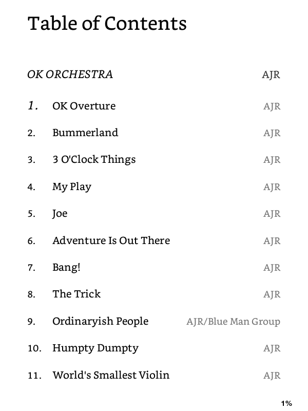
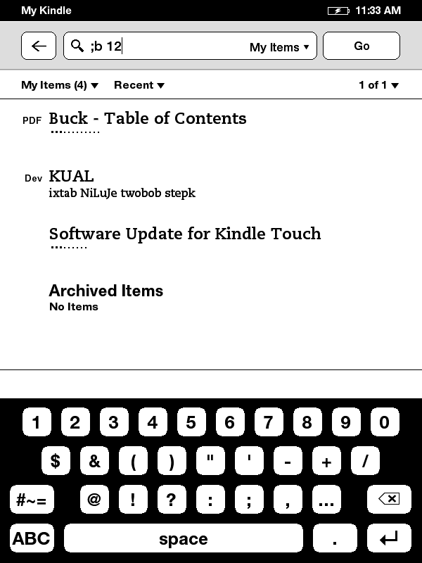

# Introduction

E-ink devices have traditionally been only for reading... well no more!

**Buck** is a fully-fledged music player for e-ink devices (tested fully for the Kindle Touch).

*Features:* 
- Using the generated Table of Contents, pick the song you wanna play 
 

- Afterwards, in the search bar, there are two commands you can do 
  `;b` - to open up the GUI 
  `;b <track number>` - to play up the track of your choice 
 

- Here's what the GUI looks like 
 

** Playlist support is not planned at the moment 

# Installation

Requirements:
- USBnet
- KUAL

In the root directory of this repo is a folder named `buck`. That's everything you'll need.

1. Move the `buck` folder to your `/mnt/us/` folder 
Folder structure:
- `/mnt/us/buck/buck`
- `/mnt/us/buck/buck-cli`
- `/mnt/us/buck/buck-cli.sh`
- `/mnt/us/buck/kual_buck`
- `/mnt/us/buck/assets`
- `/mnt/us/buck/bin`
- `/mnt/us/buck/lib`

2. The KUAL extension 
- The `/mnt/us/buck/kual_buck` folder is the KUAL extension, move it to `/mnt/us/extensions`

3. The Search Commands 
    1. SSH into your Kindle (you'll need USBnet)
    2. `mntroot rw`
    3. `vi /usr/share/webkit-1.0/pillow/debug_cmds.json`
    4. Add `";b": "/mnt/us/buck/buck-cli.sh"` at the bottom
    5. Reboot your kindle `reboot`

And that's it! You can launch it by typing `;b` or `;b <track number>`

In KUAL, you'll also have an option to restart Buck. This is if you add new songs and don't want to reboot.

**A Note About Volume:** 
**100% IS PROBABLY NOT THE BEST VOLUME!** 
The Kindle Touch is very quiet, and so there is software volume boosting going on. 
By default 100% is actually 190%. Although it works for some songs, I recommend 
sticking to **about 90%**. It gives the best balance between loudness and compatibility with 
pretty much all songs. K, have fun listening!

# Credits

First off, FBInk by NiLuJe bundled with USBnet. 

The built-in `aplayer` is terrible for advanced control of media playback, and so here 
I use the awesome `mplayer` binary built for the Kindle by the user `Smarter`

Link: https://www.mobileread.com/forums/showthread.php?t=119851&highlight=winamp

WMCtrl and the UI disabling script are the product of twobob's work from here, it made all the 
difference for the UI 
https://www.mobileread.com/forums/showthread.php?t=194270

Icons: 
https://online.rapidresizer.com/photograph-to-pattern.php 
https://pixabay.com/vectors/note-sound-music-melody-concert-24074/ 
https://pixabay.com/photos/reindeer-elk-deer-buck-antlers-5635891/