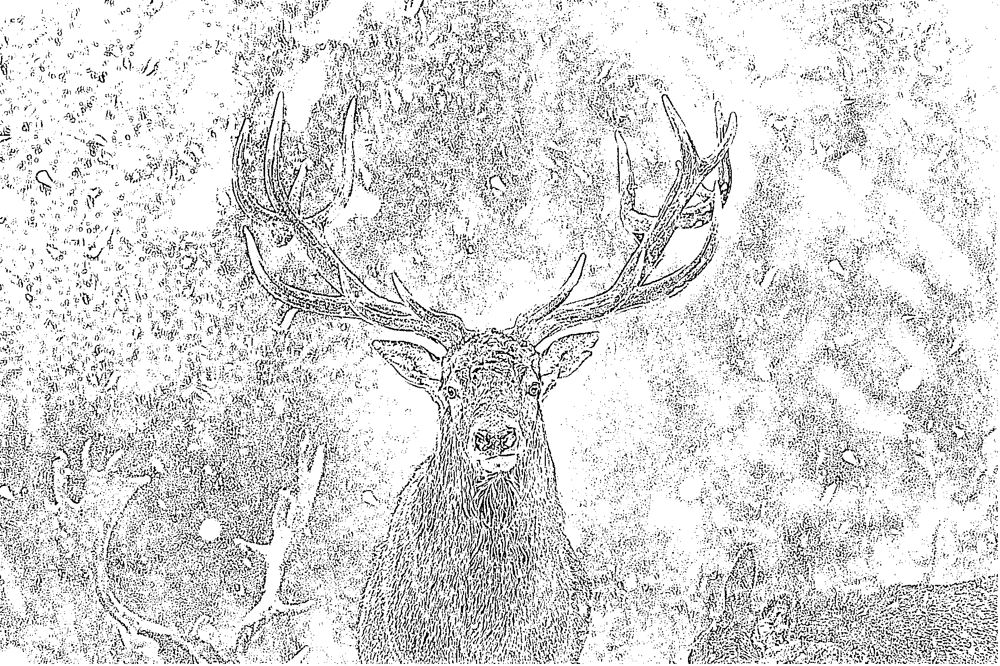

# Introduction

E-ink devices have traditionally been only for reading... well no more!

**Buck** is a fully-fledged music player for e-ink devices (tested fully for the Kindle Touch).

*Features:*<br/>
- Using the generated Table of Contents, pick the song you wanna play<br/>
<br/>

- Afterwards, in the search bar, there are two commands you can do<br/>
  `;b` - to open up the GUI<br/>
  `;b <track number>` - to play up the track of your choice<br/>
<br/>

- Here's what the GUI looks like<br/>
  Tap near the top to control volume and the bottom right to close!<br/>
<br/>

** Playlist support is not planned at the moment<br/>

# Installation on (Audiobook-enabled) Kobo devices

1. Stop Nickel from scanning hidden directories
```
Add
    [FeatureSettings]
    ExcludeSyncFolders=\\.(?!kobo|adobe).*?
to
    (from USB connection) .kobo/Kobo/Kobo\ eReader.conf
```

2. Setup Bluetooth playback<br/>
    1. Enter `devmodeon` in the Kobo search bar
    2. Go to `More > Settings > Device information > IP address`, and take note of the IP
    3. Back on your machine, install `telnet`
    4. Do `telnet <the kobo's ip>`
    5. **From this shell, you can now access /etc/alsa/conf.d/20-bluealsa.conf**
    6. Do `vi /etc/alsa/conf.d/20-bluealsa.conf`
    7. Type `I` on your keyboard to go into insert mode
    8. At the top, add this line: `defaults.bluealsa.device "00:00:00:00:00:00"` 
    9. Do `Esc`, `:wq`, `Enter`
    10. Exit out of the shell `exit`
    11. Enter `devmodeoff` in the Kobo search bar

3. Install <a href="https://github.com/pgaskin/NickelMenu/releases">NickelMenu</a>

4. Install <a href="https://www.mobileread.com/forums/showthread.php?t=299110">FBink</a>

5. Install **Buck** using the <a href="KoboRoot.tgz">KoboRoot.tgz</a> file in this repository

# Installation on Kindle Touch (K5)

Requirements:
- USBnet
- KUAL

In the root directory of this repo is a folder named `buck-k5`. That's everything you'll need.

1. Move the `buck-k5` folder to your `/mnt/us/` folder and rename to `buck`<br/>
Folder structure:
- `/mnt/us/buck/buck`
- `/mnt/us/buck/buck-cli`
- `/mnt/us/buck/buck-cli.sh`
- `/mnt/us/buck/kual_buck`
- `/mnt/us/buck/assets`
- `/mnt/us/buck/bin`
- `/mnt/us/buck/lib`

2. The KUAL extension<br/>
- The `/mnt/us/buck/kual_buck` folder is the KUAL extension, move it to `/mnt/us/extensions`

3. The Search Commands<br/>
    1. SSH into your Kindle (you'll need USBnet)
    2. `mntroot rw`
    3. `vi /usr/share/webkit-1.0/pillow/debug_cmds.json`
    4. Add `";b": "/mnt/us/buck/buck-cli.sh"` at the bottom
    5. Reboot your kindle `reboot`

And that's it! You can launch it by typing `;b` or `;b <track number>`

In KUAL, you'll also have an option to restart Buck. This is if you add new songs and don't want to reboot.

**A Note About Volume:**<br/>
**100% IS PROBABLY NOT THE BEST VOLUME!**<br/>
The Kindle Touch is very quiet, and so there is software volume boosting going on.<br/>
By default 100% is actually 150%. Although it works for some songs, I recommend<br/>
sticking to **about 90%** (although if you know a song works with 100, go for it!)<br/>
It gives the best balance between loudness and compatibility with<br/>
pretty much all songs. K, have fun listening!

# Credits

First off, the amazing FBInk by NiLuJe bundled with USBnet. The ability to draw whatever on screen is... very powerful

The built-in `aplayer` is terrible for advanced control of media playback, and so for the K5 version<br/>
I use the great `mplayer` binary built for the K5 by the user `Smarter`<br/>
Link: https://www.mobileread.com/forums/showthread.php?t=119851&highlight=winamp

WMCtrl and the UI disabling script are the product of twobob's work from here, it allowed<br/>
for much faster prototyping with the first release of the K5 version<br/>
https://www.mobileread.com/forums/showthread.php?t=194270

Icons:<br/>
https://online.rapidresizer.com/photograph-to-pattern.php<br/>
https://pixabay.com/vectors/note-sound-music-melody-concert-24074/<br/>
https://pixabay.com/photos/reindeer-elk-deer-buck-antlers-5635891/